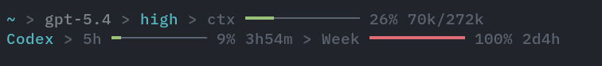
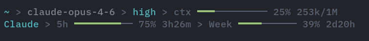

# @j1nn0/pi-footer

A Pi extension that replaces Pi's default footer with a compact status display:
working directory, Git branch, model, thinking level, and a context gauge on the
first line, followed by subscription quota bars for the active provider.

This project is a standalone fork of [`pi-minimal-footer`](https://github.com/ogulcancelik/pi-extensions/tree/main/packages/pi-minimal-footer)
by Can Celik, originally published as `@ogulcancelik/pi-minimal-footer` in the
`ogulcancelik/pi-extensions` monorepo. The footer output and provider behavior
are unchanged from the original; this repository packages it on its own and
targets Pi 1.0.





## Requirements

- Pi `>= 1.0.0` (`@earendil-works/pi-coding-agent` and `@earendil-works/pi-tui` are peer dependencies provided by Pi)
- Node.js `>= 22.19.0` (Pi 1.0's own requirement)

## Installation

```bash
pi install git:github.com/j1nn0/pi-footer
```

The package is not published to npm yet.

To try it for a single session from a local checkout:

```bash
pi -e ./index.ts
```

## What it shows

```text
~/path/to/project > main * ↑1 ↓2 > model-id > high > ctx ━━━━━─────── 41% 82k/200k
Codex > 5h ━━━━━━━─── 72% 3h > Week ━───────── 14% 4d
```

### Status line

- **Working directory** — `ctx.cwd`, with the home directory shortened to `~`.
- **Git branch** — branch name in green when clean and yellow with ` *` when the
  working tree has changes, plus `↑N` (ahead, green) and `↓N` (behind, red).
  Nothing is shown for a detached HEAD or outside a Git repository.
- **Model** — the last path segment of the model ID, or `provider/model-id`
  when `PI_MINIMAL_FOOTER_SHOW_PROVIDER` is enabled.
- **Thinking level** — shown after the model for reasoning models when the
  session's thinking level is not `off`.
- **Context gauge** — a 12-cell bar with the used percentage and
  `used/total` token counts. Colors: green below 50%, accent from 50%, yellow
  from 70%, red from 90%.

The context gauge uses the token usage of the last assistant message that was
not aborted (`input + output + cacheRead + cacheWrite`) divided by the model's
context window. It does not estimate messages sent after that response, and it
is not reset after compaction until the next response arrives, so it can differ
from Pi's built-in footer.

### Usage line

When the current model's provider is supported and its quota request succeeds,
a second line shows the provider label followed by one bar per quota window,
with the used percentage and the time until reset (`45m`, `2h38m`, `6d3h`,
`now`). Usage bars are green below 85%, yellow from 85%, and red from 92%.

### Narrow terminals

Blocks are joined with `>` while they fit and wrap onto additional lines when
they do not. Within a block, the footer falls back to shorter variants before
truncating: the location falls back to the directory alone and then to the
branch alone, the thinking level is dropped, the context gauge drops token counts and shrinks to 10, 8, 6,
or 4 cells, and usage windows shrink to 8 cells, drop the reset time, and then
shrink to 6 or 4 cells. Every line is truncated to the terminal width.

## Supported providers

The usage line is selected from the Pi provider of the current model.

| Pi provider         | Label         | Windows                                                                          | Credentials (in lookup order)                                                                                      |
| ------------------- | ------------- | -------------------------------------------------------------------------------- | ------------------------------------------------------------------------------------------------------------------ |
| `anthropic`         | `Claude`      | `5h`, `Week`                                                                     | `anthropic.access` in Pi's `auth.json`; macOS Keychain item `Claude Code-credentials`                              |
| `openai-codex`      | `Codex`       | primary (`5h` by default) and secondary (`Week`) windows                         | `openai-codex.access` (+ `accountId`) in `auth.json`; `$CODEX_HOME/auth.json` or `~/.codex/auth.json`              |
| `github-copilot`    | `Copilot`     | `Premium`, `Chat` (omitted when unlimited)                                       | `github-copilot.refresh` in `auth.json`                                                                            |
| `google-gemini-cli` | `Gemini`      | `Pro`, `Flash` (lowest remaining fraction per family, no reset time)             | `google-gemini-cli.access` in `auth.json`; `~/.gemini/oauth_creds.json`                                            |
| `minimax`           | `MiniMax`     | interval (`5h` by default) and `Week` from the Token Plan `general` bucket       | `MINIMAX_API_KEY`; `minimax` in `auth.json`                                                                        |
| `minimax-cn`        | `MiniMax CN`  | same as MiniMax, China endpoint                                                  | `MINIMAX_CN_API_KEY`; `minimax-cn` in `auth.json`                                                                  |
| `kimi-coding`       | `Kimi Coding` | each plan limit window (`5h` by default) and `Weekly`                            | `KIMI_API_KEY`; `kimi-coding` in `auth.json`                                                                       |
| `opencode-go`       | `OpenCode Go` | `5h`, `Week`, `Month`                                                            | `OPENCODE_API_KEY`; `opencode-go` in `auth.json`                                                                   |

`auth.json` is Pi's credential file at `~/.pi/agent/auth.json` (populated by
`/login`). For MiniMax, Kimi Coding, and OpenCode Go, an `auth.json` entry may
be a string or an object with `key`, `access`, or `refresh`; the value may name
an environment variable (`MY_API_KEY`) or start with `!` to run a command whose
output is the key, matching Pi's own `auth.json` conventions.

Models from any other provider show no usage line.

## Refresh behavior

- Usage is fetched when the footer is created at session start, immediately
  when the model changes, and every 5 minutes for the active provider.
- Results are cached per provider for the lifetime of the Pi process. Cached
  values are shown immediately after a model switch while a fresh request runs.
- If a refresh fails and earlier data exists, the earlier data stays visible.
- Each quota request times out after 5 seconds.
- Git state is read with `git status --porcelain=v2 --branch` (1 second
  timeout) in the directory Pi was started from, at session start, when Pi
  reports a branch change, and at the end of every turn.

## Configuration

Optional environment variables, read when the extension is loaded. The
`PI_MINIMAL_FOOTER_` prefix is kept for compatibility with the original package.

| Variable                          | Description                                          | Default |
| --------------------------------- | ---------------------------------------------------- | ------- |
| `PI_MINIMAL_FOOTER_SHOW_CWD`      | Show the working directory                           | `1`     |
| `PI_MINIMAL_FOOTER_SHOW_BRANCH`   | Show Git branch, dirty marker, and ahead/behind      | `1`     |
| `PI_MINIMAL_FOOTER_SHOW_PROVIDER` | Show `provider/model-id` instead of the short ID     | `0`     |

True values: `1`, `true`, `yes`, `on`. False values: `0`, `false`, `no`, `off`.
Values are case-insensitive and trimmed; empty or unrecognized values use the
default.

## Security

Credentials are read from the locations listed above only when a quota request
is made. They are sent only to the corresponding provider's quota endpoint, are
never rendered, logged, or included in error values, and are not written
anywhere.

## Known limitations

- **Claude** — Anthropic's `/api/oauth/usage` endpoint rate-limits by
  `User-Agent`; other clients receive persistent 429 responses
  ([claude-code#30930](https://github.com/anthropics/claude-code/issues/30930)),
  so the footer identifies as `claude-code/<version>`. With many Pi sessions
  open the bar may keep showing the last known values. The Keychain fallback is
  macOS-only.
- **Undocumented endpoints** — the Codex (`chatgpt.com/backend-api/wham/usage`),
  Copilot (`api.github.com/copilot_internal/user`), and Gemini
  (`cloudcode-pa.googleapis.com/v1internal:retrieveUserQuota`) quota APIs are
  internal and may change without notice.
- **Window labels** — a window whose length is not close to a day or a week is
  labeled with the provider's default label (for example an 8-hour Kimi window
  is shown as `5h`).
- **Gemini** — the quota API returns no reset time, so none is shown.
- **Copilot** — both windows use the account's single quota reset date.
- **Missing credentials or failed requests** — the usage line is simply not
  shown; no error is displayed.
- The footer replaces Pi's default footer entirely.

## Development

```bash
pnpm install
pnpm check
pnpm test
pnpm pack:check
```

Tests run against Pi 1.0 with mocked provider responses and never make network
requests.

## License

MIT License. See [LICENSE](LICENSE).

Based on `pi-minimal-footer`, Copyright (c) 2025 Can Celik, licensed under the
MIT License.
